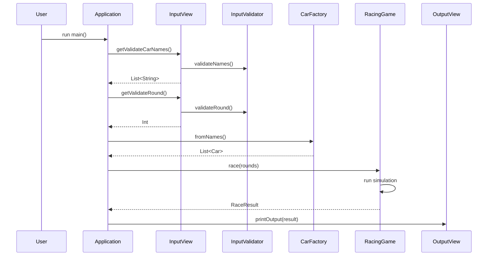

## kotlin-baseball-precourse, `Kotlin Racing Car`
A simple console-based car racing simulation game implemented in Kotlin. Cars move forward based on random number generation, with clear separation of concerns and robust error handling.

## Project Overview

This project implements a car racing game with the following key features:
- User-defined car names (validated for uniqueness and length)
- Random movement simulation over multiple rounds
- Clear, formatted race progress display
- Winner determination with support for ties

## Features
### Domain Layer
- [x] **Car**: Core entity with movement tracking and distance calculation
    - [x] Protected internal state (`_moves`) with safe public interface (`moves`)
    - [x] Name validation in constructor (1-5 characters)
    - [x] Movement tracking with `moveIf(condition: Boolean)` method
    - [x] Position calculation via `totalDistance()` and `distanceUntil(round)`
    - [x] Movement status checking with `didMoveAt(round)` and `hasMove()`

- [x] **RacingGame**: Race simulation and result aggregation
    - [x] Strategy pattern for movement logic
    - [x] Round-by-round state tracking
    - [x] Winner determination with support for ties
    - [x] History recording of race progress
    - [x] Clean interface with `race(rounds)` method returning complete results

- [x] **Strategy Pattern Implementation**
    - [x] `MoveStrategy` interface for movement determination
    - [x] `RandomMoveStrategy` using camp Randoms API (move if ≥ 4)
    - [x] Test strategies (AlwaysMoveStrategy, NeverMoveStrategy, PatternMoveStrategy)

### Input/Output Layer
- [x] **InputView**: User input handling with validation
    - [x] Reading and parsing comma-separated car names
    - [x] Reading and validating round count
    - [x] Handling conversion errors and providing helpful messages

- [x] **InputValidator**: Comprehensive validation logic
    - [x] Car name validation (1-5 chars, alphanumeric only)
    - [x] Detailed duplicate name detection with case-insensitive comparison
    - [x] Empty name and blank name validation
    - [x] Round number validation with overflow protection
    - [x] Proper error messages for each validation case

- [x] **OutputView**: Race visualization
    - [x] Progress display using dashes for each position
    - [x] Winner(s) announcement with comma-separated list
    - [x] Formatted race results with clear round separation
    - [x] "Race Results" header for visual clarity

### Data Transfer Objects
- [x] **RaceResult**: Complete race outcome representation
    - [x] Total rounds, winners, and round-by-round history
    - [x] Leading distance tracking

- [x] **RoundSnapshot**: State of all cars at a specific round
    - [x] Round number and list of car states

- [x] **CarSnapshot**: Individual car state at a specific round
    - [x] Car name and current position

### Extension Functions
- [x] **Car Extensions**: Convert domain objects to DTOs
    - [x] `Car.toSnapshot()` for state capture
    - [x] `List<Car>.toRoundSnapshot()` for bulk conversion

- [x] **View Extensions**: Formatting for display
    - [x] `CarSnapshot.toProgressBar()` for visual representation
    - [x] `RoundSnapshot.toDisplayStrings()` for round formatting
    - [x] `RaceResult.winnerText()` for winner display

- [x] **Analysis Extensions**: Race result computation
    - [x] `List<RoundSnapshot>.leadingDistance()` to find max position
    - [x] `List<RoundSnapshot>.winnerNames()` to determine winners
    - [x] `List<RoundSnapshot>.toRaceResult()` for final result compilation

### Factory
- [x] **CarFactory**: Create car instances from validated names
    - [x] `fromNames(names: List<String>): List<Car>` method

### Testing
- [x] **Domain Testing**
    - [x] `CarTest`: Movement, distance calculation, validation
    - [x] `RacingGameTest`: Movement strategy, car behavior

- [x] **Input Testing**
    - [x] `InputHandlerTest`: Name parsing, invalid delimiters
    - [x] `InputValidatorNameTest`: Length, alphanumeric, duplicates
    - [x] `InputValidatorRoundTest`: Numeric validation, bounds

- [x] **Integration Testing**
    - [x] `MoveSimulation`: Pattern-based movement simulation
    - [x] `ApplicationTest`: End-to-end functionality

- [x] **Test Support**
    - [x] `AlwaysMoveStrategy`: Forces movement for testing
    - [x] `NeverMoveStrategy`: Prevents movement for testing
    - [x] `PatternMoveStrategy`: Predefined movement sequence
    - [x] `RacingGameExtensions`: Test-specific support

## Architecture

The project follows clean architecture principles with clear separation of concerns:

```
baseball/
├── domain/            # Core business logic
│   ├── Car.kt         # Car entity with movement tracking
│   ├── RacingGame.kt  # Race simulation logic
│   └── strategy/      # Movement strategy pattern
├── factory/           # Object creation
│   └── CarFactory.kt  # Creates cars from validated names
├── input/             # Input handling and validation
│   ├── InputView.kt   # User interaction for input
│   └── InputValidator # Input validation logic
├── race/              # Race state representation
│   ├── RaceResult.kt  # Data classes for race state
│   └── *Extensions.kt # Display and analysis extensions
├── view/              # Output formatting
│   └── OutputView.kt  # Race result display
└── Application.kt     # Main entry point
```




### Design Patterns
- **Strategy Pattern**: Abstraction for movement decision logic
- **Factory Pattern**: Clean creation of Car instances
- **Extension Functions**: For clear separation of display logic

### note
Coming from a C/C++ background, this Kotlin project was an eye-opening experience.
I explored modern language features that were new to me - from objects and data classes to immutability and extension functions.
While the architecture might seem elaborate for a simple racing game, it represents my journey of discovering what "Kotlin-esque" code looks like.
Rethinking how functions and data structures should be organised was challenging but incredibly enjoyable!

---

# How to Run

### Prerequisites
- JDK 21 or higher
- Kotlin 1.9.24

### Running the Application
```bash
# Run the application
./gradlew run
```

### Running Tests
```bash
# For macOS/Linux
./gradlew clean test

# For Windows
gradlew.bat clean test
```

---

## Example Usage

```
Enter the names of the cars (comma-separated):
pobi,woni,jun
How many rounds will be played?
5

Race Results
pobi : -
woni : 
jun : -

pobi : --
woni : -
jun : --

pobi : ---
woni : --
jun : ---

pobi : ----
woni : ---
jun : ----

pobi : -----
woni : ----
jun : -----

Winners : pobi, jun
```

## Testing Strategy

The project includes comprehensive unit tests for:
- Domain logic (Car, RacingGame)
- Input validation
- Integration testing

Custom test strategies include:
- Deterministic movement strategies for predictable testing
- Pattern-based movement simulation
- Edge case testing for input validation

## Code Highlights

### Clean Domain Logic
```kotlin
class Car(val name: String) {
    private val _moves = mutableListOf<Int>()
    val moves: List<Int> get() = _moves.toList()

    fun moveIf(shouldMove: Boolean) {
        if (shouldMove) _moves.add(1) else _moves.add(0)
    }

    fun totalDistance(): Int = _moves.sum()
}
```

### Strategy Pattern for Movement
```kotlin
interface MoveStrategy {
    fun shouldMove(): Boolean
}

class RandomMoveStrategy : MoveStrategy {
    override fun shouldMove(): Boolean {
        return Randoms.pickNumberInRange(0, 9) >= 4
    }
}
```

### Robust Input Validation
```kotlin
fun validateNames(names: List<String>): List<String> {
    validateAnyEmptyNames(names)
    validateNoDuplicateNames(names)
    validateName(names)
    return names
}
```


