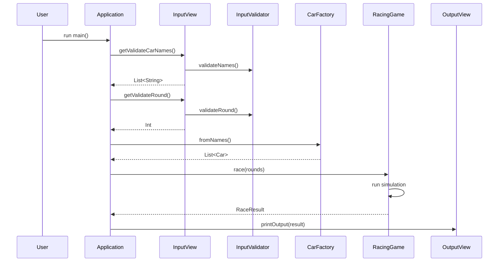

```mermaid
sequenceDiagram
    participant User
    participant Application
    participant InputView
    participant InputValidator
    participant CarFactory
    participant RacingGame
    participant OutputView

    User->>Application: run main()
    Application->>InputView: getValidateCarNames()
    InputView->>InputValidator: validateNames()
    InputView-->>Application: List<String>
    Application->>InputView: getValidateRound()
    InputView->>InputValidator: validateRound()
    InputView-->>Application: Int

    Application->>CarFactory: fromNames()
    CarFactory-->>Application: List<Car>
    Application->>RacingGame: race(rounds)
    RacingGame->>RacingGame: run simulation
    RacingGame-->>Application: RaceResult

    Application->>OutputView: printOutput(result)
```
