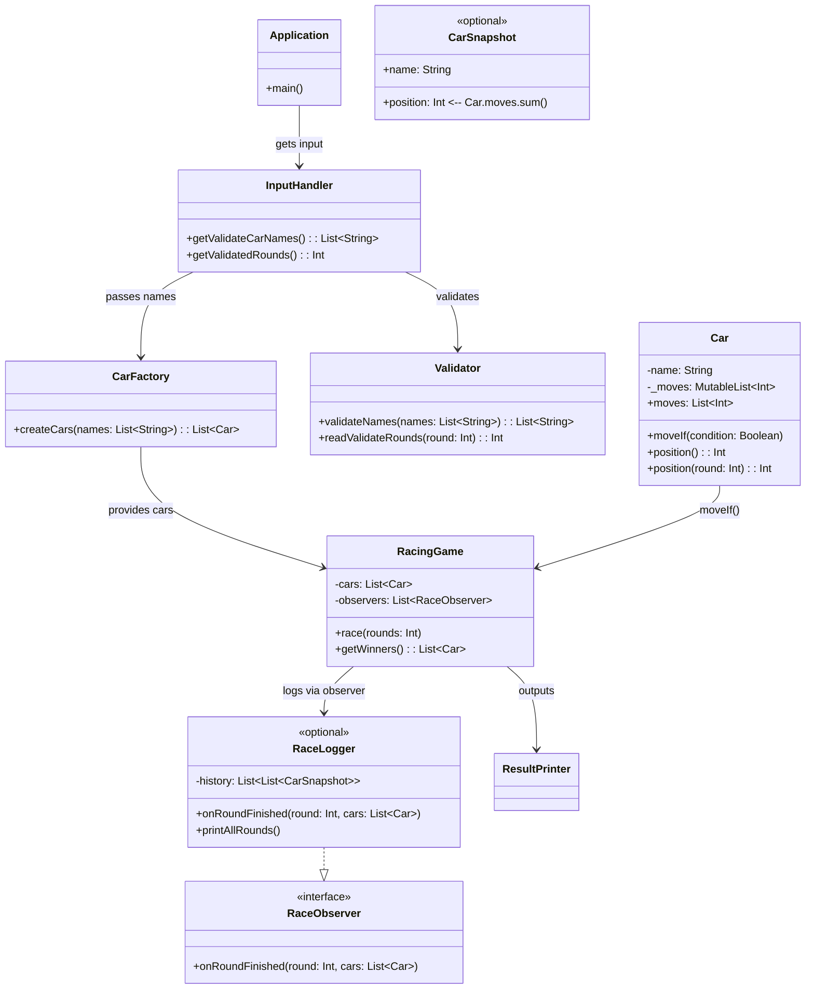

```mermaid
classDiagram
%% Application: Entry point of the program.
    class Application {
        +main()
    }

    class Car {
        -name: String
        -_moves: MutableList~Int~
        +moveIf(condition: Boolean)
        +position(): Int
        +position(round: Int): Int
        +moves: List~Int~
    }

    class RacingGame {
        -cars: List~Car~
        -observers: List~RaceObserver~
        +race(rounds: Int)
        +getWinners(): List~Car~
    }

    class CarSnapshot {
        +name: String
        +position: Int <-- Car.moves.sum()
    }
    <<optional>> CarSnapshot

    class RaceObserver {
        <<interface>>
        +onRoundFinished(round: Int, cars: List~Car~)
    }
    <<optional>> RaceObserver

    class RaceLogger {
        -history: List~List~CarSnapshot~~
        +onRoundFinished(round: Int, cars: List~Car~)
        +printAllRounds()
    }
    <<optional>> RaceLogger
    class Validator {
        +validateNames(names: List~String~): List~String~
        +readValidateRounds(round: Int): Int
    }

    class InputHandler {
        +getValidateCarNames(): List~String~
        +getValidatedRounds(): Int
    }

    class CarFactory {
        +createCars(names: List~String~): List~Car~
    }

    class ResultPrinter {
        
    }
    Application --> InputHandler : gets input
    InputHandler --> Validator : validates
    InputHandler --> CarFactory : passes names
    CarFactory --> RacingGame : provides cars
    RacingGame --> RaceLogger : logs via observer
    Car -->  RacingGame : moveIf()
    RacingGame --> ResultPrinter : outputs
    
    RaceLogger ..|> RaceObserver
```

