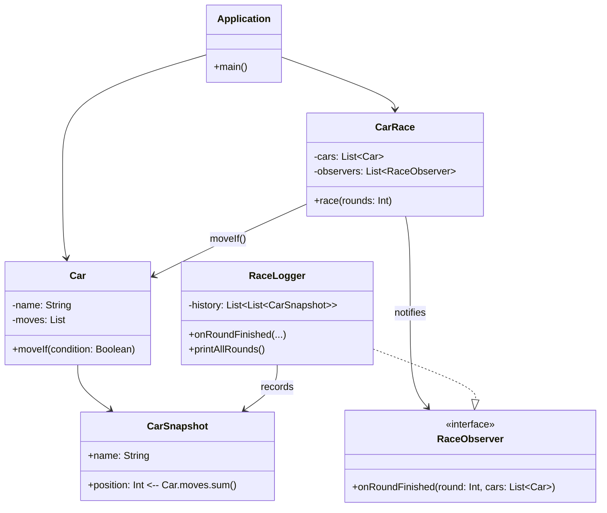

```mermaid
classDiagram
    %% Application: Entry point of the program.
    class Application {
        +main()
    }

    class Car {
        -name: String
        -moves: List<Int>
        +moveIf(condition: Boolean)
    }

    class CarSnapshot {
        +name: String
        +position: Int <-- Car.moves.sum()
    }

    class CarRace {
        -cars: List~Car~
        -observers: List~RaceObserver~
        +race(rounds: Int)
    }

    class RaceObserver {
        <<interface>>
        +onRoundFinished(round: Int, cars: List~Car~)
    }

    class RaceLogger {
        -history: List~List~CarSnapshot~~
        +onRoundFinished(...)
        +printAllRounds()
    }

    Application --> CarRace
    Application --> Car
    CarRace --> Car : moveIf()
    CarRace --> RaceObserver : notifies
    RaceLogger ..|> RaceObserver
    Car --> CarSnapshot
    RaceLogger --> CarSnapshot : records


```

